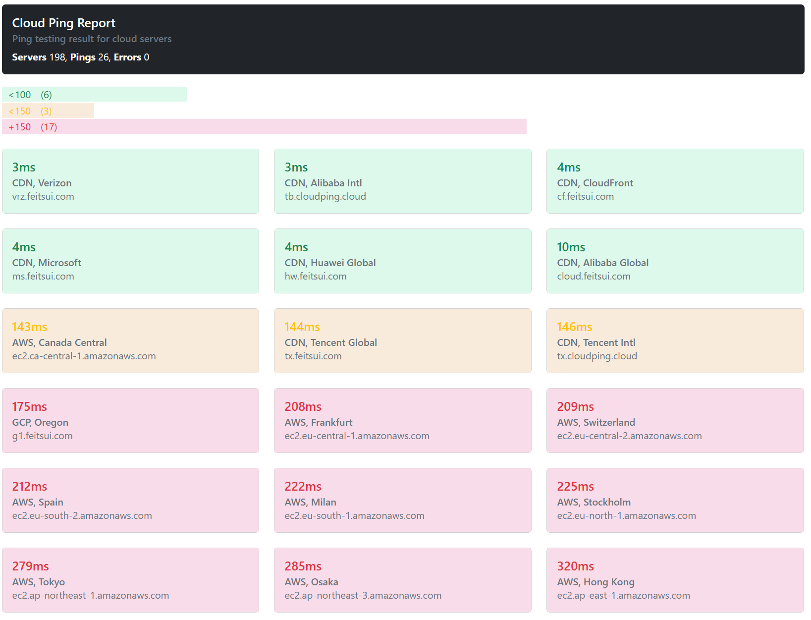

# Cloud Ping Report

This is a simple Python program created for personal use that generates an HTML report with pings from servers in different clouds, using data from the [CloudPing](https://www.cloudping.cloud/endpoints) website.

## Requirements

- Python 3.9 or higher
- Libraries: requests, pandas, subprocess, re
- Bootstrap 5
- Windows 10 or higher

## Installation

- Download or clone this repository to your computer.
- Open a terminal in the folder where the cloudping-report.py file is located.
- Install the necessary libraries using the command:
`pip install -r requirements.txt`

## Execution

- Run the program using the command:
`python cloudping-report.py`

- Wait until the program finishes testing the server pings and generates the report in HTML.
- Open the `cloudping-report.html` file in your browser to view the report.